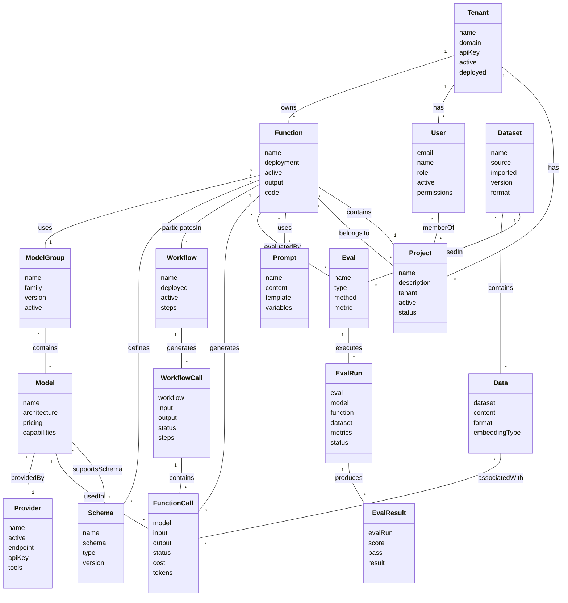
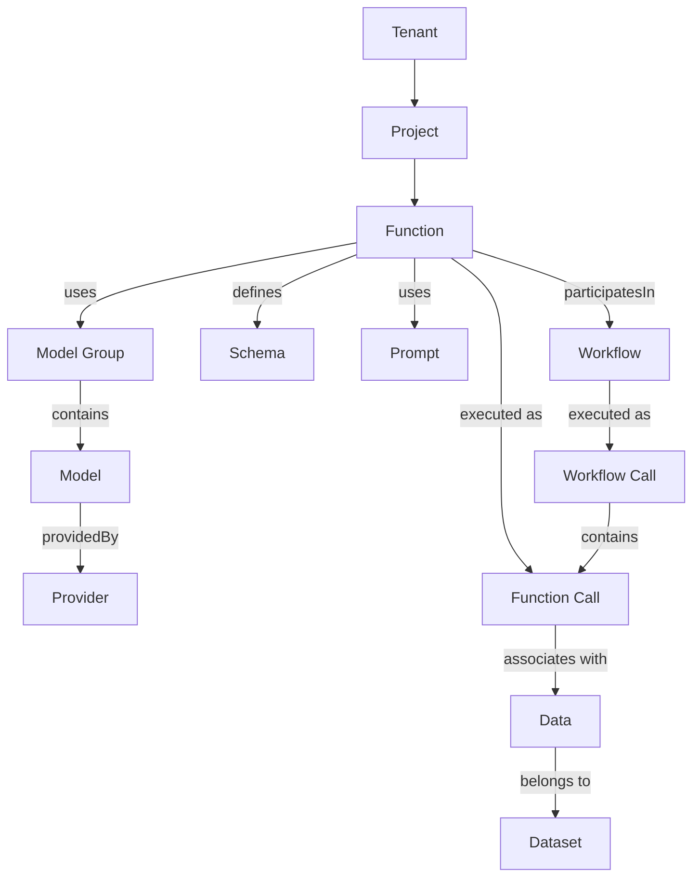
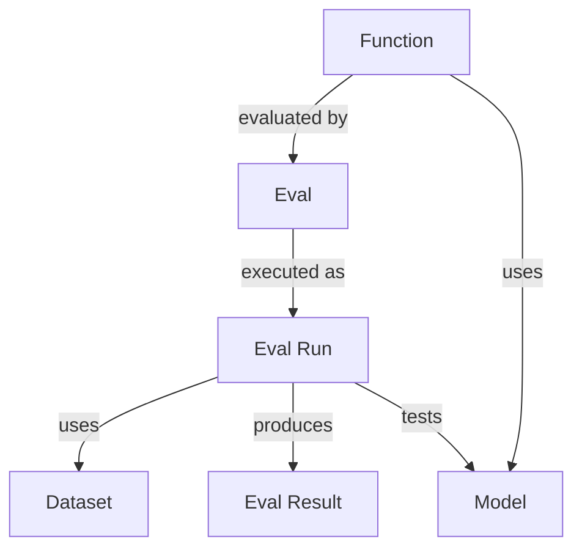
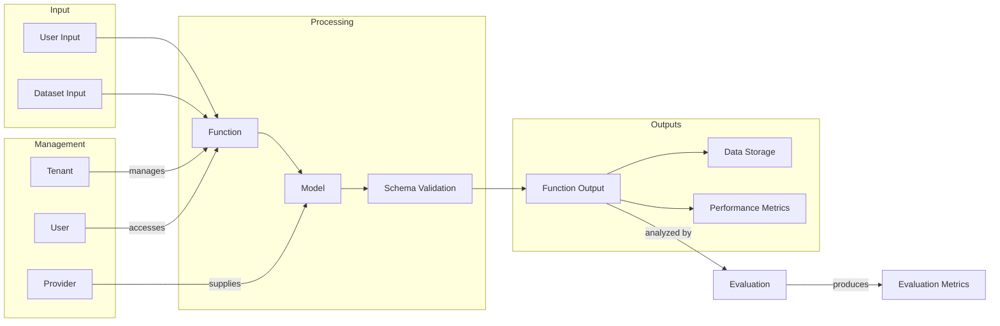

# functions.do Architecture

## Overview

This document outlines the data model architecture for the functions.do platform. The platform is built around several key entities that work together to create a comprehensive AI function deployment system.

## Core Entities

### Tenants

Tenants represent organizations or users that own and manage functions. Each tenant can have multiple functions and users.

Key fields:
- `name`: Name of the tenant
- `domain`: Associated domain
- `apiKey`: API key for authentication
- `active`: Whether the tenant is active
- `deployed`: Whether the tenant has been deployed
- Relationships: `functions`, `users`

### Functions

Functions are the core computational units that encapsulate specific AI capabilities. They can be connected to model groups, schemas, workflows, and evaluations.

Key fields:
- `name`: Name of the function
- `deployment`: Deployment environment (dev, test, prod)
- `active`: Whether the function is active
- `tenant`: Associated tenant
- `modelGroup`: Model group used by the function
- `output`: Output type (Object, Text)
- `schema`: Schema for structured output
- `code`: Contains system, user, types, validation, and deployment code
- Relationships: `workflows`, `functionCalls`, `evals`, `prompts`

### Models & Model Groups

#### Model Groups

Model groups organize models by family or version. They provide a way to manage multiple similar models.

Key fields:
- `name`: Name of the model group
- `family`: Model family (e.g., GPT, Claude)
- `version`: Version identifier
- `active`: Whether the model group is active
- Relationships: `models`, `functions`

#### Models

Models represent specific AI models with defined capabilities and pricing.

Key fields:
- `name`: Name of the model
- `modelGroup`: Associated model group
- `provider`: Associated provider
- `architecture`: Details about modality, tokenizer, and instruction type
- `pricing`: Cost information for prompts, completions, etc.
- `capabilities`: Details about context length, moderation, and tools support

### Schemas

Schemas define the structure of function inputs and outputs.

Key fields:
- `name`: Name of the schema
- `schema`: JSON schema definition
- `schemaYaml`: YAML representation of the schema
- `type`: Schema type (json, typescript, openai)
- `version`: Version identifier
- Relationships: `functions`, `models`

### Function Calls

Function calls represent executions of functions with specific inputs and outputs.

Key fields:
- `function`: Function being called
- `model`: Model used for the call
- `input`: Input data
- `output`: Output data
- `status`: Execution status (pending, running, completed, failed)
- `cost`: Cost of the function call
- `tokens`: Token usage details
- Relationships: `data`, `workflow`

### Data & Datasets

#### Datasets

Datasets organize collections of data for use with functions and evaluations.

Key fields:
- `name`: Name of the dataset
- `source`: Source of the data
- `imported`: Import date
- `version`: Version identifier
- `format`: Data format (text, json, csv, images, mixed)
- Relationships: `data`, `evals`

#### Data

Data entries represent individual data points that can be used with functions.

Key fields:
- `dataset`: Associated dataset
- `content`: Text content
- `format`: Format type (text, json, blob)
- `extractedFrom`: Source extraction information
- `embeddingType`: Type of embedding used
- `embeddingDim`: Dimensionality of embeddings
- `data`: Structured data content
- Relationships: `functionCalls`

### Evaluations

#### Evals

Evals define evaluation methodologies for functions.

Key fields:
- `name`: Name of the evaluation
- `type`: Evaluation type (accuracy, performance, robustness, safety, custom)
- `method`: Evaluation method
- `metric`: Evaluation metric
- Relationships: `dataset`, `functions`, `evalRuns`

#### EvalRuns

EvalRuns represent specific evaluation executions.

Key fields:
- `eval`: Associated evaluation
- `model`: Model being evaluated
- `function`: Function being evaluated
- `dataset`: Dataset used for evaluation
- `metrics`: Evaluation metrics
- `status`: Run status
- Relationships: `results`

#### EvalResults

EvalResults store the outcomes of evaluation runs.

Key fields:
- `evalRun`: Associated evaluation run
- `metrics`: Detailed metrics
- `score`: Overall score
- `pass`: Whether the evaluation passed
- `result`: Result data

### Workflows

#### Workflows

Workflows define sequences of function executions and control logic.

Key fields:
- `name`: Name of the workflow
- `deployed`: Whether the workflow is deployed
- `active`: Whether the workflow is active
- `steps`: Workflow steps including functions, conditions, loops, inputs, and outputs
- Relationships: `functions`, `workflowRuns`

#### Workflow Runs

Workflow runs represent specific workflow executions.

Key fields:
- `workflow`: Associated workflow
- `input`: Input data
- `output`: Output data
- `status`: Execution status
- `steps`: Details of step executions
- Relationships: `functionCalls`

### Prompts

Prompts define templates for interacting with models.

Key fields:
- `name`: Name of the prompt
- `content`: Prompt content
- `template`: Whether it's a reusable template
- `variables`: Variable definitions for template substitution
- Relationships: `functions`

### Users

Users represent system users with specific permissions.

Key fields:
- `email`: User email
- `name`: User name
- `role`: User role (admin, editor, viewer)
- `active`: Whether the user is active
- `permissions`: Detailed permissions
- Relationships: `tenants`

### Providers

Providers represent AI service providers.

Key fields:
- `name`: Provider name
- `active`: Whether the provider is active
- `endpoint`: API endpoint
- `apiKey`: Authentication key
- `authType`: Authentication type
- `tools`: Available tools information
- Relationships: `models`

## Entity Relationships

The following diagrams illustrate the complex relationships between these entities, demonstrating the structure and organization of the functions.do platform.

### Overall Entity Relationship Diagram

### Core Function Workflow

This diagram focuses on the core workflow from Tenants to Functions to Workflows.

### Evaluation System

This diagram shows how the evaluation system works.

This architecture enables the complete lifecycle of AI function development, deployment, and evaluation within the functions.do platform. The diagrams provide different perspectives on how the components interact with each other to create a comprehensive AI function deployment system.

### Data Flow Diagram

This diagram illustrates how data flows through the system during function execution and evaluation.

